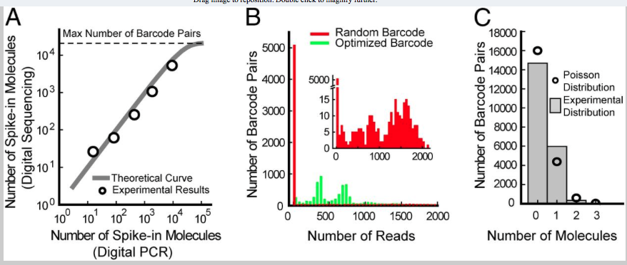

---
  html_document:
    toc: true
    highlight: zenburn
    theme: united
---

```{r setup, echo=FALSE}
knitr::opts_chunk$set(tidy=TRUE, highlight=TRUE, dev="png",
               cache=TRUE, highlight=TRUE, autodep=TRUE, warning=FALSE, error=FALSE,
               message=FALSE, prompt=TRUE, comment='', fig.cap='')
```

## Background information
This project is from Jesse
Gray's lab, they are interested in looking at the composition of the enhancer sequences they had synthesized and stuck into some viral vectors; there are several subsets of enhancers, some from mouse and human and the mouse enhancers have several positive and negative controls. The enhancer sequences we barcoded with a 16mer and they are interested in looking at what the barcode distribution looks like as well.

Most of the enhancer sequences are ~ 140mers in a sliding window across ~ 600 full length enhancer
sequences. We don't have the full sequences available yet but they are floating around
somewhere. There are about ~ 12k enhancer fragments that were synthesized.

As a first iteration, we did something super simple to get to this
point, we took the enhancer fragments and made a bwa database, then
aligned the reads to those. Before aligning the reads we stuck the
barcode for each read in the read name, so we could figure out which
barcode was associated with an alignment. Then we parsed the alignment
file to dump which enhancer sequence it aligned to, along with the
barcode that was used and some numbers about mapping quality and
number of mismatches. The code to do all of this, and this report, is up on github [here](https://github.com/hbc/gray-enhancers).

```{r read-data}
require(ggplot2)
library(knitr)
library(plyr)
library(dplyr)
in_file = "../tsv/TN03_S1_L001_R1_001.enhancer.tsv"
dat = read.table(in_file, header=TRUE, sep="\t")
# remove the reads which did not align to an enhancer
dat = tbl_df(dat[!is.na(dat$eid),])
dat$differences = dat$mismatch + dat$insertions + dat$deletions + dat$clipped
sequencing_depth = dat %>% group_by(barcode, eid) %>% summarise(count=n()) %>% ungroup()

nreads = nrow(dat)
unique_barcodes = unique(dat$barcode)
nunique_barcodes = length(unique_barcodes)
unique_reads = unique(dat[, c("barcode", "eid")])
```

The original FASTQ file has about 24 million reads in it, so that is
the starting point. Aligning those reads to the set of enhancer
sequences generates `r nreads` total alignments, with
`r nrow(unique_reads)` unique barcode-enhancer pairs represented in
those alignments which means many of the barcode-enhancer pairs have multiple
alignments representing them. Of the `r nrow(unique_reads)` unique
barcode-enhancer pairs, there are
`r length(unique(unique_reads$barcode))` unique barcodes represented,
so some barcodes are doing double double duty and either aligning to more
than one enhancer sequence or are attached to multiple enhancer
sequences.

Previous work looking at random barcoding of sequences has shown that the barcodes with 
only one read of evidence for them tend to be sequencing errors:



It looks like we can dump barcodes that only appear a small number of times, not just 1 and
remove some more noise from the data.
    
```{r depth-ber-just-barcode}
detach("package:dplyr")
library(dplyr)
grouped = dat %>% group_by(barcode) %>% summarise(count=n()) %>% ungroup()
ggplot(grouped, aes(count)) + geom_histogram() + scale_x_log10() +
  theme_bw(base_size=12, base_family="Gill Sans") +
  theme(panel.grid.major = element_line(size = .5, color = "grey"))
```

We start with `r nrow(grouped)` unique barcodes and 
we dump those barcodes that appear less than four times as sequencing errors in the
barcode.

```{r dump-likely-erroneous-barcodes}
dat = dat %>% group_by(barcode) %>% filter(n() > 4) %>% ungroup()
grouped = dat %>% group_by(barcode) %>% summarise(count=n())
ggplot(grouped, aes(count)) + geom_histogram() + scale_x_log10() +
  theme_bw(base_size=12, base_family="Gill Sans") +
  theme(panel.grid.major = element_line(size = .5, color = "grey"))
```

This leaves us with `r nrow(dat)` total alignments to work with and `r nrow(grouped)` barcodes.
If we further restrict and now group by eid and barcode instead of just barcode, 
we can identify another set of
likely-erroneous barcode + eid combinations to remove.
The idea behind this is that if a barcode + eid is really present in the sample, we should
have sequenced more than one read for it and generate more than one alignment for that barcode.

```{r depth-per-eid-and-barcode}
likely_erroneous = dat %>% group_by(barcode, eid) %>% summarise(count=n())
ggplot(likely_erroneous, aes(count)) + geom_histogram() + scale_x_log10() +
  theme_bw(base_size=12, base_family="Gill Sans") +
  theme(panel.grid.major = element_line(size = .5, color = "grey"))
```

```{r depth-per-eid-and-barcode-filtered}
dat = dat %>% group_by(barcode, eid) %>% filter(n() > 2) 
filtered_depth = dat %>% group_by(barcode, eid) %>% summarise(count=n())
ggplot(filtered_depth, aes(count)) + geom_histogram() + scale_x_log10() +
  theme_bw(base_size=12, base_family="Gill Sans") +
  theme(panel.grid.major = element_line(size = .5, color = "grey"))
```
 
This leaves us with `r nrow(dat)` total alignments to work with and `r nrow(sequencing_depth)`
unique barcodes + eid to work with. There are `r length(unique(dat$barcode))` unique barcodes
and `r length(unique(dat$eid))` unique EIDs detected.

After that initial cleaning, we have a table *dat* which is a set of
`r nrow(dat)` alignments where we have removed alignments where we
thought it was pretty likely the barcode was wrong due to a sequencing
error. Some of these alignments are seen repeatedly. Here we group alignments
by barcode, eid, the number of differences, the mapping quality and the
score of the primary and secondary alignments to identify alignments that
are identical.

```{r identifical-alignment-counts}
cleaned = dat[, 2:ncol(dat)] %>% group_by(barcode, eid, differences, mapq, as, xs) %>%
  mutate(count = n()) %>% ungroup() %>% distinct()
ggplot(cleaned, aes(count)) + geom_histogram() + scale_x_log10() +
  theme_bw(base_size=12, base_family="Gill Sans") +
  theme(panel.grid.major = element_line(size = .5, color = "grey"))
```

This gets us down to `r nrow(cleaned)` distinct alignments. From the
above plot we can see there are many alignments that appear only a
small number of times. These are again likely errors, but this time in
the enhancer sequence, not the barcodes.

Here is an example from one barcode + eid combination:

```{r example-enhancer-errors}
x = subset(cleaned, barcode == "TGGCTGGTGTTGTAGT")
x$count
subset(x[, c("barcode", "eid", "differences", "mismatch", "count", "as", "xs")], count > 10)
```

We can see the sequence identified by barcode "TGGCTGGTGTTGTAGT" likely
has 5 differences in the sequence to enhancer id 63406153. This is the best alignment,
as the secondary alignment (xs) has a lower score than the primary alignment (as).
The other sequences we see tagged by this barcode are likely to be sequencing errors;
then next most common sequence we see has an extra mismatch to enhancer 63406153.
We have 234 reads of evidence that this sequence is present in the sample, so we can
be pretty sure these errors are likely synthesis errors.

So another useful filtering is to take only the barcode+eid that we have seen the most, and we
will call this the true sequence going forward.

```{r best-set}
clean = cleaned %>% group_by(barcode, eid) %>% filter(count==max(count)) %>% ungroup()
```

Now we can break down what these look like.

```{r clean-distribution}
ggplot(clean, aes(count)) + geom_histogram() + scale_x_log10() +
  theme_bw(base_size=12, base_family="Gill Sans") +
  theme(panel.grid.major = element_line(size = .5, color = "grey"))
```

It looks like we can do one final filtering, filter out barcode+eid sequences where the
most common hit has < 10 counts.

```{r final-clean}
clean = subset(clean, count >= 10)
ggplot(clean, aes(count)) + geom_histogram() + scale_x_log10() +
  theme_bw(base_size=12, base_family="Gill Sans") +
  theme(panel.grid.major = element_line(size = .5, color = "grey"))
exact = subset(clean, differences == 0)
```

That leaves us with `r nrow(clean)` barcode + enhancer sequences to consider.
Those are represented by `r length(unique(clean$barcode))` barcodes and
`r length(unique(clean$eid))` enhancer ids.

`r nrow(exact)` of the barcode + eid sequences are exact matches
to the enhancer sequences, representing 6884 distinct enhancer sequences. 

So the last piece in the puzzle is to spit out the actual sequences.

## dat$differences = dat$mismatch + dat$insertions + dat$deletions + dat$clipped
## best_set = tbl_df(dat) %>% group_by(barcode, eid) %>% filter(differences == min(differences)) %>% distinct()
## best_set$is_unique = !duplicated(best_set$eid)
## write.table(best_set, file="best_set.csv", quote=FALSE, sep=",",
##   col.names=TRUE, row.names=FALSE)
## save(best_set, file="best_set.RData")
## barcodes = best_set$barcode
```

The first thing to look at is the distribution of barcodes. Below is a plot of the
theoretical distribution of edit distance between a random barcode and the other
barcodes if we assume we are equally likely to use and sequence a barcode.

```{r theoretical-barcode-distribution-plot}
edit_distance = function(i) {
  return(i^3 * factorial(16) / (factorial(i) * factorial(16-i)))
}

edit_table = function(seq, sequences) {
  table(unlist(lapply(sequences, function(x) adist(seq, x))))
}

tdistances = unlist(Map(edit_distance, 0:16))
tdistances = tdistances / sum(tdistances)
qplot(factor(0:16), tdistances, geom="bar", stat="identity") +
  xlab("edit distance") + ylab("") + 
  ggtitle("Theoretical distribution of edit distances for 16 mers") +
  theme_bw(base_size=12, base_family="Gill Sans") +
  theme(panel.grid.major = element_line(size = .5, color = "grey"))
```

Below is the empirical distribution of a barcode we only had one read of evidence for:

```{r empirical-barcode-distribution-plot}
one_barcode = sequencing_depth[sequencing_depth$count == 1,][1,]$barcode

distances = table(unlist(lapply(barcodes, function(x) adist(one_barcode, x))))
distances = distances / sum(distances)
m = merge(data.frame(distances), data.frame(levels=factor(0:16)),
    by.x="Var1", by.y="levels", all=TRUE)
m[is.na(m)] = 0
colnames(m) = c("distance", "count")
m$distance = as.factor(as.numeric(as.character(m$distance)))
m = m[order(m$distance),]
```

```{r edit-distance-plot}
qplot(factor(0:16), m$count, geom='bar', stat='identity') + 
  xlab("edit distance") + ylab("") + 
  ggtitle("Empirical edit distance distribution of unique barcodes.") +
  theme_bw(base_size=12, base_family="Gill Sans") +
  theme(panel.grid.major = element_line(size = .5, color = "grey"))
```

Here are the differences between the theoretical and empirical distributions of
barcode edit distances for a barcode with only one read of evidence:

```{r tdistances-single-count-plot}
qplot(factor(0:16), log2((tdistances + 0.01)/(m$count + 0.01)), geom="bar", stat="identity") +
  ylab("log2(theoretical/emperical)") +
  xlab("") +
  theme_bw(base_size=12, base_family="Gill Sans") +
  theme(panel.grid.major = element_line(size = .5, color = "grey"))
```

Barcode and enhancers that were sequenced multiple times might have a different distribution,
due to errors in the barcode. If this was true we'd expect an enrichment for edit distances
1 away from a barcode. We could concievably count the same barcode twice if we confuse
a barcode with a sequencing error for a unique barcode.

```{r multi-barcode-plot}
multi_barcode = as.character(sequencing_depth[which.max(sequencing_depth$count),]$barcode)
distances = table(unlist(lapply(barcodes, function(x) adist(multi_barcode, x))))
distances = distances / sum(distances)
m = merge(data.frame(distances), data.frame(levels=factor(0:16)),
    by.x="Var1", by.y="levels", all=TRUE)
m[is.na(m)] = 0
colnames(m) = c("distance", "count")
m$distance = as.factor(as.numeric(as.character(m$distance)))
m = m[order(m$distance),]

qplot(factor(0:16), m$count, geom='bar', stat='identity') + 
  xlab("edit distance") + ylab("") + 
  ggtitle("Empirical edit distance distribution of unique barcodes.") +
  theme_bw(base_size=12, base_family="Gill Sans") +
  theme(panel.grid.major = element_line(size = .5, color = "grey"))
```

```{r tdistance-plot}
qplot(factor(0:16), log2((tdistances + 0.01)/(m$count + 0.01)), geom="bar", stat="identity") +
  ylab("log2(theoretical/emperical)") +
  xlab("") +
  theme_bw(base_size=12, base_family="Gill Sans") +
  theme(panel.grid.major = element_line(size = .5, color = "grey"))
```

For the MiSeq, the published rate
is around 0.4% per base, so for these 16 mers we should be expecting
about 7% of the barcodes to have a single error.
I'm also surprised that the barcodes from IDT really do seem to be distributed somewhat evenly throughout all possible barcodes. It is awesome being wrong sometimes.


Below is a plot of the number of times each enhancer is seen with a
unique barcode. Some enhancers are represented much more than others.

```{r reads-per-eid-plot}
reads_per_eid = best_set %>% group_by(eid) %>% summarise(count=n())
summary(reads_per_eid$count)

ggplot(reads_per_eid, aes(count)) + geom_histogram() + scale_x_sqrt() +
  xlab("# of enhancers with this many unique barcodes") +
  ylab("# of unique barcodes") + 
  theme_bw(base_size=12, base_family="Gill Sans") +
  theme(panel.grid.major = element_line(size = .5, color = "grey"))
```

Below is a plot in the other direction, the number of times each barcode is seen.
Most barcodes are uniquely used and are seen only on a single enchancer.

```{r read-per-barcode-plot}
reads_per_barcode = best_set %>% group_by(barcode) %>% summarize(count=n())
ggplot(reads_per_barcode, aes(count)) + geom_histogram() + scale_x_sqrt() +
  ylab("# of enhancers") + xlab("# of barcodes on this many different enhancers") +
  theme_bw(base_size=12, base_family="Gill Sans") +
  theme(panel.grid.major = element_line(size = .5, color = "grey"))
```

Only `r length(unique(best_set$eid))` unique enhancers were recovered during alignment.
Of those, some had better mapping quality than others:

Some enhancers had better mapping quality than others; mapping quality may be due to
mistmatches or it also may be to the enhancer mapping equally well to the enhancers
that were synthesized.

```{r mapq-plot}
ggplot(best_set, aes(mapq)) + geom_histogram() +
  theme_bw(base_size=12, base_family="Gill Sans") +
  theme(panel.grid.major = element_line(size = .5, color = "grey"))
```

Similarly, there is a spread of number of differences of the best hit, with the majority only
having a small number of mismatches. 

```{r mismatch-plot}
ggplot(best_set, aes(differences)) + geom_histogram() +
  theme_bw(base_size=12, base_family="Gill Sans") + scale_x_log10() +
  theme(panel.grid.major = element_line(size = .5, color = "grey"))
```


In general, mapping quality decreases with the number of differences with the enhancer sequence, but there is a range at each value.

```{r mismatch-vs-mapq-plot}
ggplot(best_set, aes(as.factor(differences), mapq)) + geom_boxplot() +
  xlab("# of mismatches") +
  ylab("mapping quality") +
  theme_bw(base_size=12, base_family="Gill Sans") +
  theme(panel.grid.major = element_line(size = .5, color = "grey"),
        axis.ticks = element_blank(), axis.text.x = element_blank())
```

Mixing the human and mouse sequences is generally a bad plan, the sequences are very similar
and it is difficult to distinguish them from each other, which is reflected in the range
of mapping quality values; many of the sequences could have come from multiple different
enhancer sequences.

Some enhancer sequences don't have a best hit. Here are the enhancer sequences that are missing:

```{r missing-enhancers, results='asis'}
enhancer_fn = "../metadata/enhancer.tsv"
enhancers = read.table(enhancer_fn, header=TRUE, stringsAsFactors=FALSE)
enhancers$seen = enhancers$eid %in% best_set$eid
nmissing = nrow(subset(enhancers, !seen))
nseen = nrow(subset(enhancers, seen))
out_table = data.frame(table(enhancers$seen))
colnames(out_table) = c("seen", "count")
kable(out_table, format="html")
```

Out of `r nrow(enhancers)` there are `r nmissing` missing and `r nseen` seen
enhancers. Here is a breakdown by type, we are missing around 13% of both the endogenous
and Sliding subtypes across both the human and the mouse.

```{r enhancer-table, results='asis'}
out_table = data.frame(table(enhancers[, c("subtype", "seen", "species")]))
colnames(out_table) = c("subtype", "seen", "species", "count")
kable(out_table, format="html")
write.table(subset(enhancers, !seen), file="missing_enhancers.csv", quote=FALSE, sep=",",
  col.names=TRUE, row.names=FALSE)
```

For enhancers that are seen, for each eid we output the barcode that had the least number
of differences. The vast majority have 0 mismatches:

```{r best-matches-plot}
best_matches = tbl_df(dat) %>% group_by(eid) %>% filter(differences == min(differences)) %>% distinct()
ggplot(best_matches, aes(differences)) + geom_histogram() +
  xlab("differences") +
  theme_bw(base_size=12, base_family="Gill Sans") +
  theme(panel.grid.major = element_line(size = .5, color = "grey"))
m = merge(best_matches, enhancers, by=c("eid", "species", "subtype"))
write.table(m, file="best_matches.csv", quote=FALSE, sep=",",
  col.names=TRUE, row.names=FALSE)
```
