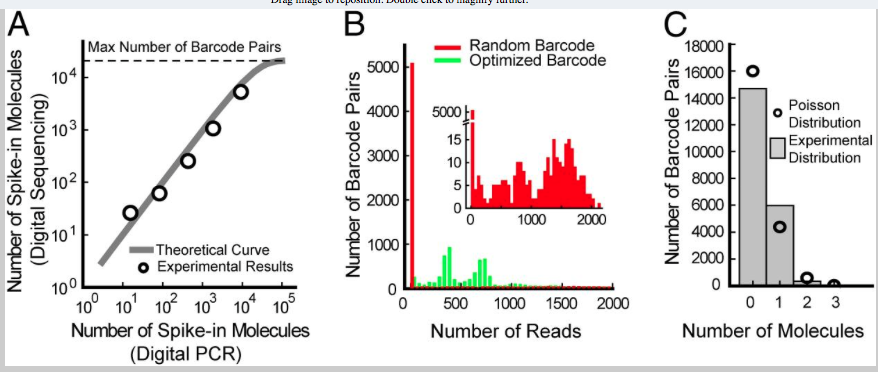

---
  html_document:
    toc: true
    highlight: zenburn
    theme: united
---

```{r setup, echo=FALSE}
knitr::opts_chunk$set(tidy=TRUE, highlight=TRUE, dev="png",
               cache=TRUE, highlight=TRUE, autodep=TRUE, warning=FALSE, error=FALSE,
               message=FALSE, prompt=TRUE, comment='', fig.cap='')
```

## Background information
This project is from Jesse
Gray's lab, they are interested in looking at the composition of the enhancer sequences they had synthesized and stuck into some viral vectors; there are several subsets of enhancers, some from mouse and human and the mouse enhancers have several positive and negative controls. The enhancer sequences we barcoded with a 16mer and they are interested in looking at what the barcode distribution looks like as well.

Most of the enhancer sequences are ~ 140mers in a sliding window across ~ 600 full length enhancer
sequences. We don't have the full sequences available yet but they are floating around
somewhere. There are about ~ 12k enhancer fragments that were synthesized.

As a first iteration, we did something super simple to get to this
point, we took the enhancer fragments and made a bwa database, then
aligned the reads to those. Before aligning the reads we stuck the
barcode for each read in the read name, so we could figure out which
barcode was associated with an alignment. Then we parsed the alignment
file to dump which enhancer sequence it aligned to, along with the
barcode that was used and some numbers about mapping quality and
number of mismatches along with the sequence that was sequenced. The code to do all of this,
and this report, is up on github [here](https://github.com/hbc/gray-enhancers).

```{r read-data}
require(ggplot2)
library(knitr)
library(plyr)
library(dplyr)
in_file = "../align/TN03_S1_L001_R1_001.tsv"
dat = read.table(in_file, header=TRUE, sep="\t")
# remove the reads which did not align to an enhancer
dat = tbl_df(dat[!is.na(dat$eid),])
dat$differences = dat$mismatch + dat$insertions + dat$deletions + dat$clipped
sequencing_depth = dat %>% group_by(barcode, eid) %>% summarise(count=n()) %>% ungroup()

nreads = nrow(dat)
unique_barcodes = unique(dat$barcode)
nunique_barcodes = length(unique_barcodes)
unique_reads = unique(dat[, c("barcode", "eid")])
```

The original FASTQ file has about 24 million reads in it, so that is
the starting point. Aligning those reads to the set of enhancer
sequences generates `r nreads` total alignments, with
`r nrow(unique_reads)` unique barcode-enhancer pairs represented in
those alignments which means many of the barcode-enhancer pairs have multiple
alignments representing them. Of the `r nrow(unique_reads)` unique
barcode-enhancer pairs, there are
`r length(unique(unique_reads$barcode))` unique barcodes represented,
so some barcodes are doing double double duty and either aligning to more
than one enhancer sequence or are attached to multiple enhancer
sequences.

Previous work looking at random barcoding of sequences has shown that the barcodes with 
only one read of evidence for them tend to be sequencing errors:



It looks like we can dump barcodes that only appear a small number of times, not just 1 and
remove some more noise from the data.
    
```{r depth-ber-just-barcode}
detach("package:dplyr")
library(dplyr)
grouped = dat %>% group_by(barcode) %>% summarise(count=n()) %>% ungroup()
ggplot(grouped, aes(count)) + geom_histogram() + scale_x_log10() +
  theme_bw(base_size=12, base_family="Gill Sans") +
  theme(panel.grid.major = element_line(size = .5, color = "grey"))
```

We start with `r nrow(grouped)` unique barcodes and 
we dump those barcodes that appear less than four times as sequencing errors in the
barcode.

```{r dump-likely-erroneous-barcodes}
dat = dat %>% group_by(barcode) %>% filter(n() > 4) %>% ungroup()
grouped = dat %>% group_by(barcode) %>% summarise(count=n())
ggplot(grouped, aes(count)) + geom_histogram() + scale_x_log10() +
  theme_bw(base_size=12, base_family="Gill Sans") +
  theme(panel.grid.major = element_line(size = .5, color = "grey"))
```

This leaves us with `r nrow(dat)` total alignments to work with and `r nrow(grouped)` barcodes.
If we further restrict and now group by eid and barcode instead of just barcode, 
we can identify another set of
likely-erroneous barcode + eid combinations to remove.
The idea behind this is that if a barcode + eid is really present in the sample, we should
have sequenced more than one read for it and generate more than one alignment for that barcode.

```{r depth-per-eid-and-barcode}
likely_erroneous = dat %>% group_by(barcode, eid) %>% summarise(count=n())
ggplot(likely_erroneous, aes(count)) + geom_histogram() + scale_x_log10() +
  theme_bw(base_size=12, base_family="Gill Sans") +
  theme(panel.grid.major = element_line(size = .5, color = "grey"))
```

```{r depth-per-eid-and-barcode-filtered}
dat = dat %>% group_by(barcode, eid) %>% filter(n() > 2) 
filtered_depth = dat %>% group_by(barcode, eid) %>% summarise(count=n())
ggplot(filtered_depth, aes(count)) + geom_histogram() + scale_x_log10() +
  theme_bw(base_size=12, base_family="Gill Sans") +
  theme(panel.grid.major = element_line(size = .5, color = "grey"))
```
 
This leaves us with `r nrow(dat)` total alignments to work with and `r nrow(sequencing_depth)`
unique barcodes + eid to work with. There are `r length(unique(dat$barcode))` unique barcodes
and `r length(unique(dat$eid))` unique EIDs detected.

After that initial cleaning, we have a table *dat* which is a set of
`r nrow(dat)` alignments where we have removed alignments where we
thought it was pretty likely the barcode was wrong due to a sequencing
error. Some of these alignments are seen repeatedly. Here we group alignments
by barcode, eid, the number of differences, the mapping quality and the
score of the primary and secondary alignments to identify alignments that
are identical.

```{r identifical-alignment-counts}
cleaned = dat[, 2:ncol(dat)] %>% group_by(barcode, eid, differences, mapq, as, xs, seq) %>%
  mutate(count = n()) %>% ungroup() %>% distinct()
ggplot(cleaned, aes(count)) + geom_histogram() + scale_x_log10() +
  theme_bw(base_size=12, base_family="Gill Sans") +
  theme(panel.grid.major = element_line(size = .5, color = "grey"))
```

This gets us down to `r nrow(cleaned)` distinct alignments. From the
above plot we can see there are many alignments that appear only a
small number of times. These are again likely errors, but this time in
the enhancer sequence, not the barcodes.

Here is an example from one barcode + eid combination:

```{r example-enhancer-errors}
x = subset(cleaned, barcode == "TGGCTGGTGTTGTAGT")
x$count
subset(x[, c("barcode", "eid", "differences", "mismatch", "count", "as", "xs")], count > 10)
```

We can see the sequence identified by barcode "TGGCTGGTGTTGTAGT" likely
has 5 differences in the sequence to enhancer id 63406153. This is the best alignment,
as the secondary alignment (xs) has a lower score than the primary alignment (as).
The other sequences we see tagged by this barcode are likely to be sequencing errors;
then next most common sequence we see has an extra mismatch to enhancer 63406153.
We have 234 reads of evidence that this sequence is present in the sample, so we can
be pretty sure these errors are likely synthesis errors.

So another useful filtering is to take only the barcode+eid that we have seen the most, and we
will call this the true sequence going forward.

```{r best-set}
clean = cleaned %>% group_by(barcode, eid, seq) %>% filter(count==max(count)) %>% ungroup()
```

Now we can break down what these look like.

```{r clean-distribution}
ggplot(clean, aes(count)) + geom_histogram() + scale_x_log10() +
  theme_bw(base_size=12, base_family="Gill Sans") +
  theme(panel.grid.major = element_line(size = .5, color = "grey"))
```

Before we were doing one final filtering, filtering out barcode+eid sequences where the
most common hit had < 10 counts. We think this hurt our sensitivity though, we were missing
some real sequences. Here we drop that filtering to < 3 counts to try to recover more
of the enhancer sequences.

```{r final-clean}
clean = subset(clean, count >= 3)
ggplot(clean, aes(count)) + geom_histogram() + scale_x_log10() +
  theme_bw(base_size=12, base_family="Gill Sans") +
  theme(panel.grid.major = element_line(size = .5, color = "grey"))
exact = subset(clean, differences == 0)
```

That leaves us with `r nrow(clean)` barcode + enhancer sequences to consider.
Those are represented by `r length(unique(clean$barcode))` barcodes and
`r length(unique(clean$eid))` enhancer ids.

`r nrow(exact)` of the barcode + eid sequences are exact matches
to the enhancer sequences, representing 6884 distinct enhancer sequences.


Each enhancer sequence is represented multiple by multiple barcodes:

```{r reads-per-eid-plot}
reads_per_eid = clean %>% group_by(eid) %>% summarise(count=n())
ggplot(reads_per_eid, aes(count)) + geom_histogram() + scale_x_log10() +
  xlab("# of enhancers with this many unique barcodes") +
  ylab("# of unique barcodes") + 
  theme_bw(base_size=12, base_family="Gill Sans") +
  theme(panel.grid.major = element_line(size = .5, color = "grey"))
```

Below is a plot in the other direction, the number of times each barcode is seen.
Most barcodes are uniquely used and are seen only on a single enchancer one we
remove the likely erroneous barcodes.

```{r read-per-barcode-plot}
reads_per_barcode = clean %>% group_by(barcode) %>% summarize(count=n())
ggplot(reads_per_barcode, aes(count)) + geom_histogram() + scale_x_sqrt() +
  ylab("# of enhancers") + xlab("# of barcodes on this many different enhancers") +
  theme_bw(base_size=12, base_family="Gill Sans") +
  theme(panel.grid.major = element_line(size = .5, color = "grey"))
```

Some enhancers had better mapping quality than others. It looks like it separates out
by subtype.

```{r mapq-plot}
ggplot(clean, aes(subtype, mapq)) + geom_boxplot() +
  theme_bw(base_size=12, base_family="Gill Sans") +  xlab("") +
  theme(panel.grid.major = element_line(size = .5, color = "grey"))
```

Similarly, there is less of a spread of the differences to the best hit,
though the sliding and endongenous subtypes seem to have and enrichment for
a low number of mismatches.

```{r mismatch-plot}
ggplot(clean, aes(subtype, differences)) + geom_violin() +
  theme_bw(base_size=12, base_family="Gill Sans") + scale_y_sqrt() +
  theme(panel.grid.major = element_line(size = .5, color = "grey"))
```
In general, mapping quality decreases with the number of differences with the enhancer sequence, but there is a range at each value.

```{r mismatch-vs-mapq-plot}
ggplot(clean, aes(differences, mapq)) + geom_point() + facet_wrap(~ subtype) +
  xlab("# of mismatches") +
  ylab("mapping quality") +
  theme_bw(base_size=12, base_family="Gill Sans") +
  theme(panel.grid.major = element_line(size = .5, color = "grey"),
        axis.ticks = element_blank(), axis.text.x = element_blank())
```

```{r as-vs-xs}
ggplot(clean, aes(as, xs)) + geom_point() + facet_wrap(~ subtype) +
  xlab("score of best alignment") +
  ylab("score of second best alignment") +
  theme_bw(base_size=12, base_family="Gill Sans") +
  theme(panel.grid.major = element_line(size = .5, color = "grey"),
        axis.ticks = element_blank(), axis.text.x = element_blank())
```

Some enhancer sequences don't have a best hit. Here are the enhancer sequences that are missing:

```{r missing-enhancers, results='asis'}
enhancer_fn = "../metadata/enhancer.tsv"
enhancers = read.table(enhancer_fn, header=TRUE, stringsAsFactors=FALSE)
enhancers$seen = enhancers$eid %in% clean$eid
nmissing = nrow(subset(enhancers, !seen))
nseen = nrow(subset(enhancers, seen))
out_table = data.frame(table(enhancers$seen))
colnames(out_table) = c("seen", "count")
kable(out_table, format="markdown")
```

Out of `r nrow(enhancers)` there are `r nmissing` missing and `r nseen` seen
enhancers. Here is a breakdown by type:

```{r enhancer-table, results='asis'}
out_table = data.frame(table(enhancers[, c("subtype", "seen", "species")]))
colnames(out_table) = c("subtype", "seen", "species", "count")
kable(out_table, format="markdown")
write.table(subset(enhancers, !seen), file="missing_enhancers.csv", quote=FALSE, sep=",",
  col.names=TRUE, row.names=FALSE)
```

Finally we write out the cleaned data to a big table. This table has for each
barcode and enhancer sequence the number of mismatches, indels, etc for the alignment
to the specified enhancer sequence. The alignment is the best hit for the sequence and
the mismatches are likely synthesis errors, because we saw them in at least 3 separate
identical reads. The consensus sequence that generated the best hit is in the seq
column of the table.

```{r write-clean}
write.table(clean, file="clean.csv", quote=FALSE, sep=",", col.names=TRUE, row.names=FALSE)
```

## How did we do recovering the highly expressed barcodes?
These are cDNA counts from two replicates of two conditions, sequencing from plasmid
DNA. I'm not too clear on where this data came from; is it a similar type of experiment? 

```{r read-bc-data}
bc_file = "../metadata/TN03/TN03_MiSeq_tallies_raw_bcs.tsv"
cdna_bc = read.table(bc_file, sep="\t", header=TRUE)
rownames(cdna_bc) = cdna_bc$bc
rownames(cdna_bc) = as.factor(rownames(cdna_bc))
cdna_bc$bc = NULL
```

This has `r nrow(cdna_bc)` barcodes, we are only picking up about 210k barcodes so we
are only getting about half of the data. A bunch of these barcodes have very low counts,
only appearing a small number of times in some conditions.

```{r bc-data-plot}
qplot(rowSums(cdna_bc)) + geom_histogram() +
  theme_bw(base_size=12, base_family="Gill Sans") + scale_x_log10() + 
  theme(panel.grid.major = element_line(size = .5, color = "grey"))
```

These might be errors, we can do something similar as we did above and drop barcodes that
appear < 3 times.

```{r subset-cdna-barcodes}
cdna_bc = subset(cdna_bc, rowSums(cdna_bc) >=3)
high_bc = subset(cdna_bc, rowSums(cdna_bc) >=100)
```

That leaves us with `r nrow(cdna_bc)` and puts us closer to the `r nrow(clean)`
barcodes we recover from this experiment. In the original, non-cleaned dataset we
are missing `r nrow(cdna_bc) - sum(rownames(cdna_bc) %in% dat$barcode)` out of
`r nrow(cdna_bc)` barcodes.
If we restruct this to barcodes with total counts > 100 then we 
are missing `r nrow(high_bc) - sum(rownames(high_bc) %in% dat$barcode)` out of `r nrow(high_bc)`
barcodes. k

Why are we missing these still? It depends on the barcode. For example TTTGCGTTCGTGCGTT is missing,
but only appears a small number of times in the reads, and most of the time it is a very short sequence. Only one read was long enough to have a real enhancer sequence in it.

barcode AAAACTATCGTTTGAG is highly expessed in the cDNA data and has many reads with that
sequence in it. It has a lot of reads that all match the barcode and both of the adapter sequences match. The enhancer sequence looks fine:

GAGCCGTGGACTTCGGCGAAGCGACCACAACAACAACGGAGGCGGCGGCGGCAGCGACGACTACTCCACAGGCGGGACTTCCGGCTGCCGGAGCCTAGCAACCTCCCGGGGCGGGGCTTCCGGCGGGCCTGGTAAGAG

This barcode appears many times in the original TSV file:

```{r missing-barcode}
subset(dat, barcode == "AAAACTATCGTTTGAG")
```

So what is the deal, why are we missing it?

The enhancer sequence doesn't have a full length match to any
particular sequence. The GC content is high, 70%. There is a lot of
sequencing errors in this enhancer sequence and there are only 32
reads, and it just happens that none of them are repeated more than
twice, even though we know what enhancer the sequence is for, we don't have enough
evidence to call the actual sequence that way we are doing it.

To rescue these types of reads, we'd have to do something like call a consensus sequence and
then realign. But since we are missing 4,000 barcodes right from the start, this would at most
fix the 1.5k or so that are filtered out by the cleaning process.
